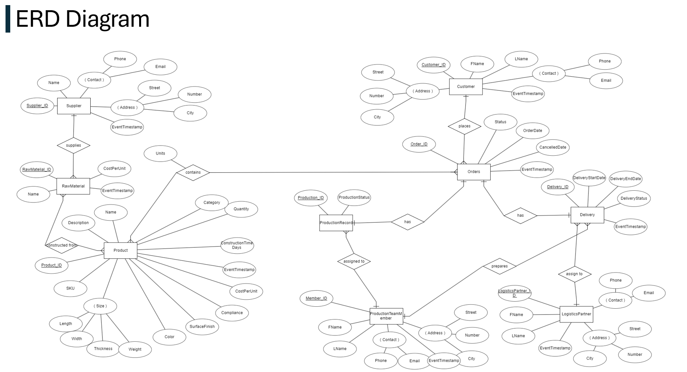
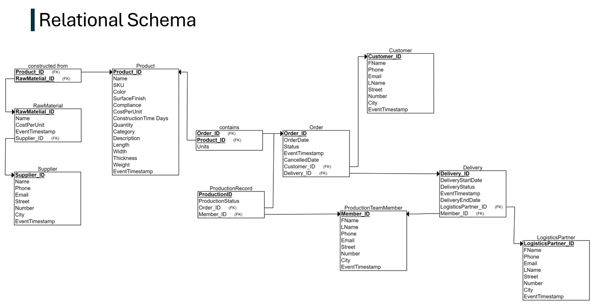

# Blueprint

This folder contains the Entity-Relationship Diagram (ERD) and Relational Schema of the OLTP database designed for the Cataschevastica project.

## ERD Diagram

The ERD diagram illustrates the entities, attributes, and relationships within the OLTP system.

## Relational Schema

The Relational Schema represents the logical structure of the database, showing the tables, columns, and relationships based on the ERD.

---

